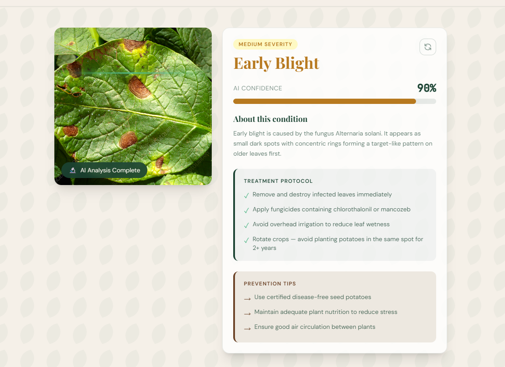
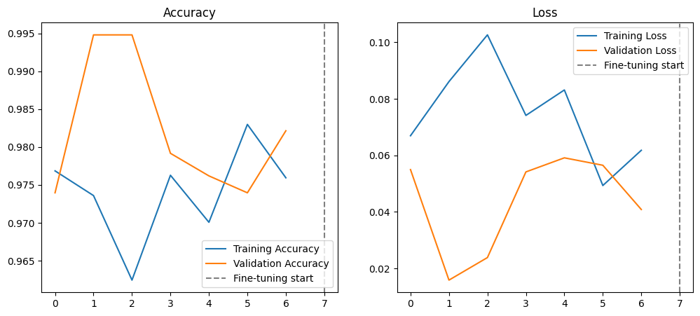

# Potato Disease Classification

A production-style AI application for potato leaf disease classification using **Transfer Learning**, **TensorFlow Serving**, **FastAPI**, **React**, and **Docker**.

---

## Demo

<p align="center">
  
</p>

> Demo video is available on my LinkedIn profile.

---

## Overview

This project classifies potato leaf diseases from uploaded images using a deep learning model trained with TensorFlow.

Rather than focusing only on model training, the project demonstrates a complete AI deployment pipeline by integrating a React frontend, FastAPI backend, TensorFlow Serving, and Docker.

The application predicts one of the following classes:

- Early Blight
- Late Blight
- Healthy

Along with the prediction, it provides:

- Confidence score
- Disease description
- Treatment recommendations
- Prevention tips

---

## Features

- Potato leaf disease classification
- Transfer Learning with MobileNetV2
- Fine-Tuned deep learning model
- Confidence score prediction
- Disease information
- Treatment recommendations
- Prevention guidelines
- FastAPI REST API
- TensorFlow Serving for inference
- Docker & Docker Compose support
- Responsive React interface

---

## System Architecture

```text
                React Frontend
                       │
                       ▼
                FastAPI Backend
                       │
                       ▼
            TensorFlow Serving
                       │
                       ▼
          MobileNetV2 SavedModel
```

---

## Model Development

The project initially started with a custom CNN model. Although the results were acceptable, the overall performance and generalization were not satisfactory.

To improve the model, the architecture was redesigned using **Transfer Learning**.

The final model uses **MobileNetV2** pretrained on **ImageNet** as the feature extractor, followed by custom classification layers.

### Training Pipeline

```text
Dataset
   │
   ▼
Data Augmentation
   │
   ▼
MobileNetV2 (ImageNet)
   │
   ▼
Global Average Pooling
   │
   ▼
Dense (128, ReLU)
   │
   ▼
Dropout (0.3)
   │
   ▼
Softmax Output
   │
   ▼
Fine-Tuning
```

### Training Strategy

The following techniques were used during training:

- Transfer Learning
- Fine-Tuning
- Data Augmentation
- EarlyStopping
- ReduceLROnPlateau
- Adam Optimizer

After training the classifier head, the deeper layers of MobileNetV2 were selectively unfrozen and fine-tuned using a lower learning rate to improve generalization.

---

## Model Performance

### Best Validation Performance

| Metric | Value |
|---------|------:|
| Best Validation Accuracy | **99.48%** |
| Lowest Validation Loss | **0.0158** |

### Training Curves

<p align="center">
  
</p>

The learning curves indicate stable convergence with consistently high validation accuracy and low validation loss throughout training.

---

## Tech Stack

| Layer | Technology |
|--------|------------|
| Frontend | React |
| Backend | FastAPI |
| Deep Learning | TensorFlow / Keras |
| Model | MobileNetV2 |
| Model Serving | TensorFlow Serving |
| Containerization | Docker & Docker Compose |

---

## Project Structure

```text
potato-disease/
│
├── api/
├── frontend/
├── models/
├── training/
├── images/
├── Dockerfile
├── docker-compose.yml
├── requirements.txt
└── README.md
```

---

## Getting Started

### Clone the repository

```bash
git clone https://github.com/Omar-Elgendey/potato-disease.git
cd potato-disease
```

### Run with Docker

```bash
docker compose up --build
```

The application will start with:

- React Frontend
- FastAPI Backend
- TensorFlow Serving

---

## API Endpoint

### Predict Disease

```http
POST /predict
```

Returns:

```json
{
  "class": "Early Blight",
  "confidence": 0.90
}
```

---

## Future Improvements

- Cloud deployment
- Support for additional plant diseases
- Grad-CAM visualization
- User authentication
- Prediction history

---

## Author

**Omar Mohamed**

GitHub: https://github.com/Omar-Elgendey

LinkedIn: *(www.linkedin.com/in/omar-elgendey-b142a0357

)*
